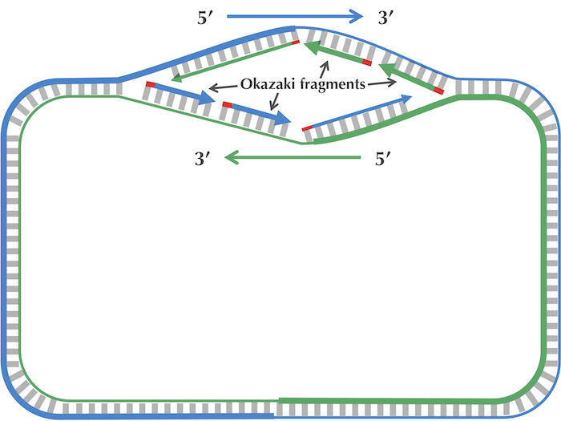
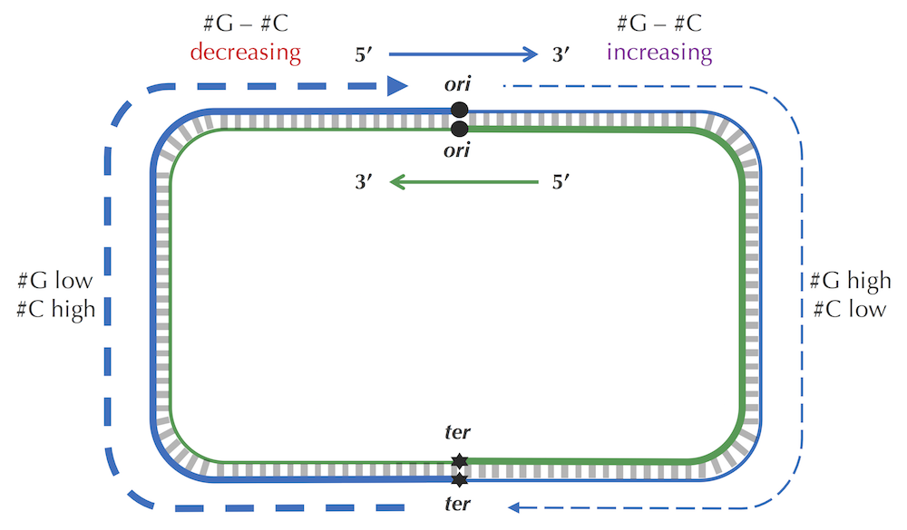

```{python}
#| echo: false
#| label: setup
import numpy as np
import polars as pl
import matplotlib.pyplot as plt
from matplotlib.ticker import FuncFormatter

plt.rcParams['axes.labelsize'] = 14
plt.rcParams['figure.dpi'] = 400
plt.rcParams['figure.figsize'] = (10, 6)
plt.rcParams['figure.constrained_layout.use'] = True
```

## The Origin of Replication

The **origin of replication** (_ori_) is a specific DNA sequence at which DNA replication begins.
It is the genomic region where the cellular machinery assembles and starts to synthesize new DNA strands.
Due to its importance, there are experimental methods to elucidate the position of the ori-site, although this
process takes time, effort, and expertise. 

In recent years, 2nd- and 3rd-generation sequencing platforms have drastically reduced the time and cost to assemble
draft genomes. Short sequencing reads allows for good genome depth while long reads reduce the uncertainty when building
contigs from shorter sequences by increasing coverage. 
As a computational biologist, I would want to leverage this fact by finding ways to amortize the vast amounts of genomes published online.

Going back to the problem of _ori_ finding, can we build heuristics for finding this region using only the genome sequence as input?
We will dive into the ideas from Compeau's and Pevzner's book entitled _Bioinformatics Algorithms: An Active Learing Approach_
and implement the algorithms in code.

## Genome Dataset

The goal is to develop heuristics that can be used to find the _ori_ of bacterial genomes from sequence data alone.
I will be using the _Vibrio cholera_ genome as an example. First, let's explore the properties of the genome by loading
it into memory and computing a few properties such as length, base composition, and GC content.

```{python}
#| label: load-genome
# Load genome
genome_fp = "data/Vibrio_cholerae.txt"
with open(genome_fp, "r") as fh:
    genome = fh.read()

# Compute length
genome_length = len(genome)

# Compute base frequencies
base_freqs = {base: genome.count(base) for base in set(genome)}

# Compute GC content
gc_content = round((base_freqs['G'] + base_freqs['C']) / genome_length, 2)
```

```{python}
#| label: load-genome-display
#| echo: false
print("Genome length:", genome_length)
print("Base counts:", base_freqs)
print(f"GC content: {gc_content:.2%}")
```

## Expected K-mer Distribution

If we were to assume that the occurrence of DNA bases are uniformly distributed across a genome, the probability of observing a particular
nucleotide at any position is given as:

$$ P(A) = P(T) = P(G) = P(G) = \frac{1}{4} $$

Under this model, the occurrence of nucleotide bases are assumed to be independent. Hence the probability of a sequence of
_k_ bases is simply the product of probabilities of each base:

$$ P(\text{k-mer}) = (\frac{1}{4})^k $$ 

We can then compute the expected frequncy of the _k_-mer using the formula:

$$ E = (L-k+1) \times (\frac{1}{4})^k $$

:::{.column-margin}
L = genome length
:::

:::{.callout-tip title="Example"}

How many _ATGCG_ substrings are expected to occur in the _V. cholerae_ genome?

$$ E = (1108250 - 5 + 1) \times (\frac{1}{4})^5 = 1082 $$

Under the null distribution, we expect any 5-mer to occur 1082 times.

::: 

## Frequent Words

In order to initate replication, DNA polymerase must somehow recognize and bind to the _ori_.
This interaction is mediated by **motifs**, DNA sequences that have a higher affinity towards the binding
domain of proteins. We can start to identify these motifs by finding the most frequent substrings of length _k_.

```{python}
#| label: most-frequent-kmer
def most_frequent_kmer(genome: str, k: int):
    """Compute k-mer frequencies and return k-mer set with the highest counts"""
    L = len(genome)

    # Compute frequncies
    kmer_counts = {}
    for i in range(L-k+1):
        kmer = genome[i:i+k]
        if kmer in kmer_counts:
            kmer_counts[kmer] += 1
        else:
            kmer_counts[kmer] = 1

    # Compute maximum count
    max_count = max(kmer_counts.values())

    # Retain k-mers with counts equal to max_count
    max_kmers = []
    for kmer, count in kmer_counts.items():
        if count == max_count:
            max_kmers.append(kmer)

    return max_kmers
```

```{python}
#| label: fig-max-kmer-counts
#| fig-cap: Number of most-frequent _k_-mers for k = 1...20
#| echo: false
ks = range(3, 15) 
nmax = [len(most_frequent_kmer(genome, k)) for k in ks]
nmax = np.array(nmax, dtype=np.int8)

fig, ax = plt.subplots(figsize=(10, 6), dpi=400, layout="tight")

ax.bar(ks, nmax)
plt.show()
```

At $k = 11$, we find 5 most-frequent _k_-mers. Is this result surprising? Let's first check the sequences of the 11-mers.

```{python}
#| label: tbl-11mer-seqs
#| fig-cap: Sequences of the most frequent 11-mers
#| echo: false
mer11 = most_frequent_kmer(genome, 11)
pl.DataFrame({'n': range(1, len(mer11)+1), 'sequence': mer11})
```

Notice that there is substantial overlap between the 2^nd^ and 3^rd^ 11-mers when we shift the 3^rd^ 11-mer one position to the right.
Do the same for the other 11-mers (except for the first one) until the _AAA_ subregions align:

```
GGGACTGGAAA
 GGACTGGAAAC
  GACTGGAAACG
   ACTGGAAACGC
```

The _ACTGGAAA_ 8-mer seems like a good candidate for the _ori_ binding motif for _V. cholerae_.

## Asymmetry of Replication

DNA consists of two complementary strands that run in opposite (antiparallel) directions. 
One runs in the $5' \to 3'$ (leading strand) direction while the other runs in the $3' \to 5'$ (lagging strand) direction.
Since **DNA polymerase** can only add nucleotides in the $5' \to 3'$ direction, synthesis on the lagging strand is fragmented and discontinuous.
This phenomenon leads to the formation of small gaps called **Okazaki fragments**.

{#fig-okazaki width=80%}

The transient single-stranded state of the lagging strand makes it unstable and more prone to mutation.
It has been empirically confirmed that mutation rates are slightly higher for the lagging strand and this has been attributed
to the spontaneous conversion of cytosine (C) to thymine (T), a phenomenon known as **deamination**.

As we move along the genome, we will observe a change in relative GC content. The frequency of cytosine will decrease
in the forward half-strand due to deamination and increase in the reverse half-strand (@fig-skew-diagram). 

{#fig-skew-diagram}

We capture this information by keeping track of the running difference betwee the total counts of G and C. 
We then visualize the results in a **skew diagram**. Let's plot the skew diagram for _V. cholerae_

```{python}
#| label: compute-genome-skew
import numpy as np

def skew(genome: str) -> np.array:
    """Compute the GC skew of a sequence"""
    L = len(genome)
    skew = np.zeros(genome_length+1)
    for pos, base in enumerate(genome, start=1):
        if base == "G":
            skew[pos] = skew[pos-1] + 1
        elif base == "C":
            skew[pos] = skew[pos-1] - 1
        else:
            skew[pos] = skew[pos-1]

    return skew
```
    

```{python}
#| label: fig-genome-skew
#| fig-cap: Genome skew of _V. cholerae_
#| echo: false

positions = range(0, len(genome)+1)
gc_skew = skew(genome)

fig, ax = plt.subplots(figsize=(10, 6), dpi=400, layout="tight")

ax.plot(positions, gc_skew)
ax.axvspan(145_000, 155_000, color='lightgreen', alpha=0.3, label='ori')
ax.axvspan(565_000, 575_000, color='lightcoral', alpha=0.3, label='ter')

ax.set_xlabel("Position")
ax.set_ylabel("Skew \n ($count_G - count_C$)")
ax.xaxis.set_major_formatter(
    lambda x, pos: f"{x/1000} Kb"
)

plt.show()
```

As illustrated in @fig-skew-diagram, the part of the graph where the skew transitions from decreasing to increasing is the _ori_ (highlighted in green).
The part where the skew goes from increasing to decreasing is the _ter_ (highlighted in red), the region where replication stops or terminates.
